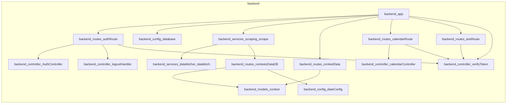

# Contest Scrapper

Contest Scrapper is a comprehensive platform designed to aggregate programming contest data from various sources. It automates the collection of contest schedules, provides a centralized dashboard for users, and enables seamless synchronization of contest events to Google Calendar.

## Features

- **Automated Data Scraping:** Periodically fetches updated contest information using Python-based scripts.
- **Google OAuth2 Authentication:** Secure user login and session management via Google accounts.
- **Google Calendar Integration:** Allows users to create calendar events directly from the contest dashboard.
- **Scheduled Updates:** Uses `node-cron` to automatically trigger scraping and database synchronization tasks.
- **Responsive Dashboard:** A clean, React-based interface for browsing upcoming programming contests.

## Tech Stack

- **Backend:** JavaScript (Node.js, Express), Python
- **Frontend:** React.js
- **Database:** MongoDB (via Mongoose), Redis (Caching)
- **Authentication:** Google OAuth2
- **Task Scheduling:** `node-cron`
- **Data Scraping:** Cheerio, Python (Selenium/requests)

## Architecture



## Installation

### Prerequisites
- Node.js (v16+)
- Python 3.x
- MongoDB instance
- Redis server (optional)

### Setup
1. Clone the repository:
   ```bash
   git clone https://github.com/Devesh-coder/contest-list-scrapper.git
   cd contest-list-scrapper
   ```
2. Install backend dependencies:
   ```bash
   cd backend
   npm install
   ```
3. Install frontend dependencies:
   ```bash
   cd ../frontend
   npm install
   ```
4. Set up environment variables in `backend/.env`:
   ```env
   PORT=5000
   MONGO_URL=your_mongodb_connection_string
   CLIENT_ID=your_google_client_id
   CLIENT_SECRET=your_google_client_secret
   FRONTEND_URL=http://localhost:3000
   ```
5. Run the application:
   ```bash
   npm run dev
   ```

## API Documentation

### Base URL
```
http://localhost:5000
```

### Authentication
The application uses Google OAuth2 for authentication. Tokens are managed via cookies and passed in headers for protected routes.

### Endpoints

#### Authentication
**POST /auth/google** - Authenticate user via Google OAuth2.

**GET /auth/google/refresh-token/:uid** - Refresh the user's access token.

**GET /auth/verify** - Verify the current session token.

**GET /auth/logout** - Clear session and logout.

#### Contests
**GET /contests** - Retrieve the list of all stored programming contests.

```json
// Response
{
  "contests": [
    {
      "name": "Codeforces Round #123",
      "link": "https://codeforces.com/...",
      "startTime": "2023-10-27T10:00:00Z",
      "duration": "2h"
    }
  ]
}
```

#### Calendar
**POST /create-event/:id** - Create a calendar event for a specific contest.

```json
// Request
{
  "summary": "Contest Name",
  "start": "ISO-Date-String",
  "end": "ISO-Date-String"
}
```

```json
// Response
{
  "status": "success",
  "message": "Event created successfully"
}
```

## Project Structure

- `backend/`: Contains the Express server, database models, controllers, and scraping services.
  - `routes/`: API endpoint definitions.
  - `services/`: Logic for scraping and data processing.
  - `models/`: Mongoose schemas for MongoDB.
- `frontend/`: Contains the React application for the user dashboard.

## Contributing

1. Fork the repository.
2. Create your feature branch (`git checkout -b feature/AmazingFeature`).
3. Commit your changes (`git commit -m 'Add some AmazingFeature'`).
4. Push to the branch (`git push origin feature/AmazingFeature`).
5. Open a Pull Request.

## License

This project is licensed under the MIT License.