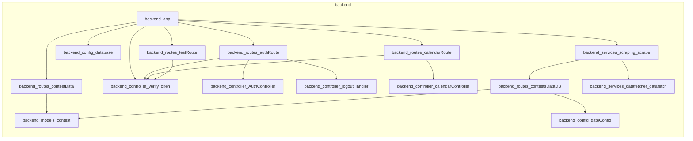

# Contest Scrapper

Contest Scrapper is a centralized platform designed to aggregate competitive programming contest data from various sources. It features automated scheduling, user authentication via Google, and seamless integration with Google Calendar to help users track and manage their coding contest schedules.

## Features

- **Automated Data Scraping**: Periodic background tasks using `node-cron` and Python-based scrapers to keep contest data up-to-date.
- **Google Authentication**: Secure user login and session management using OAuth2.
- **Calendar Integration**: Ability to sync contests directly to your Google Calendar.
- **Dashboard**: A responsive frontend built with React and Tailwind CSS featuring data visualization and calendar views.
- **Persistent Storage**: Contest data managed via MongoDB with Mongoose ODM.

## Tech Stack

- **Frontend**: React, Redux, Tailwind CSS, Material Tailwind, FullCalendar, Nivo Charts.
- **Backend**: Node.js, Express, MongoDB (Mongoose), Redis (caching).
- **Scraping**: Python, Selenium, Cheerio.
- **Authentication**: Google OAuth2 (`google-auth-library`).
- **DevOps/Tools**: `node-cron`, `concurrently`, `nodemon`.

## Architecture



## Installation

### Prerequisites
- Node.js (v16+)
- MongoDB instance
- Python 3.x (for scraping scripts)
- Google Cloud Console Project (for OAuth2 credentials)

### Setup
1. **Clone the repository**:
   ```bash
   git clone https://github.com/Devesh-coder/contest-list-scrapper.git
   cd contest-list-scrapper
   ```

2. **Install dependencies**:
   ```bash
   npm install
   cd backend && npm install
   cd ../frontend && npm install
   ```

3. **Environment Variables**:
   Create a `.env` file in the `backend/` directory:
   ```env
   PORT=5000
   MONGO_URL=your_mongodb_connection_string
   CLIENT_ID=your_google_client_id
   CLIENT_SECRET=your_google_client_secret
   FRONTEND_URL=http://localhost:3000
   ```

4. **Run the application**:
   ```bash
   npm run dev
   ```

## API Documentation

### Authentication (`/auth`)
- `POST /auth/google`: Exchange Google authorization code for session tokens.
- `GET /auth/google/refresh-token/:uid`: Refresh user authentication token.
- `GET /auth/verify`: Verify the current session token.
- `GET /auth/logout`: Clear session cookies and logout.

### Contests (`/contests`)
- `GET /contests`: Retrieve all stored programming contests.
  - **Response**: `Array<{ _id, contestName, contests: [{ name, link, startTime, duration }] }>`

### Calendar (`/create-event`)
- `POST /create-event/:id`: Create a Google Calendar event for a specific contest.
  - **Auth**: Required (Bearer token)
  - **Params**: `:id` (Contest ID)

### Test (`/test`)
- `POST /test`: Validate authentication middleware.

## Project Structure

- `backend/`: Contains the Express server, API routes, database models, and scraping services.
  - `controllers/`: Request handling logic.
  - `models/`: Mongoose schemas.
  - `services/`: Scraping logic and cron jobs.
- `frontend/`: React application code.
  - `src/`: Components, state management, and API integration.

## Contributing

1. Fork the repository.
2. Create a feature branch (`git checkout -b feature/AmazingFeature`).
3. Commit your changes (`git commit -m 'Add some AmazingFeature'`).
4. Push to the branch (`git push origin feature/AmazingFeature`).
5. Open a Pull Request.

## License

This project is licensed under the MIT License.